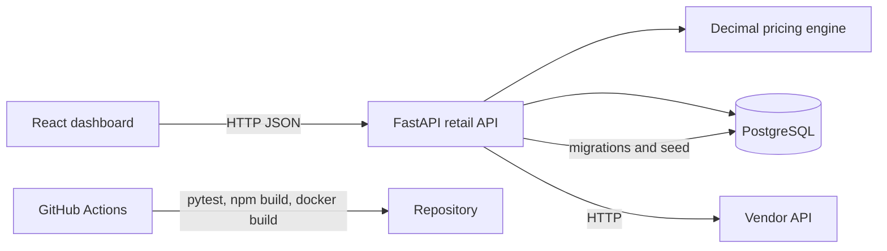

# Retail Price Automation

Retail price automation dashboard that synchronizes vendor costs, calculates margin-aware retail prices, applies safe automatic updates, and routes exceptional changes to a human review workflow.

## Business Problem and Solution

Retail teams often receive vendor cost changes faster than they can safely review and publish new shelf prices. Manual spreadsheets are slow, difficult to audit, and vulnerable to rounding errors.

This project provides a complete workflow: a vendor API supplies prices, the backend matches them to products, a Decimal-based pricing engine calculates the suggested price, and the system either updates the POS price automatically or records a review-required change. Operators can search products, inspect audit history, approve changes, reject changes with a reason, and edit product controls.

## Features

- Vendor-price synchronization with match and unmatched-record totals
- Margin-based retail pricing with `ROUND_HALF_UP` currency rounding
- Configurable automatic-update threshold
- Dashboard metrics for monitored products, daily changes, reviews, and sync status
- Product search, category/status filters, pagination, and editable controls
- Audit-log search, date/status/category filters, sorting, and detail drawer
- Approval and rejection workflow with persisted audit decisions
- PostgreSQL persistence with Alembic migrations and idempotent demo seed data
- Responsive React interface with loading, empty, error, and mutation states

## Tech Stack

- Frontend: React, TypeScript, Vite, React Router, Tailwind CSS
- Backend: Python 3.12, FastAPI, SQLAlchemy, Pydantic, Alembic
- Data: PostgreSQL 16
- Testing: pytest
- Local orchestration: Docker Compose
- CI: GitHub Actions

## Architecture



The browser talks only to the retail API. The retail API owns pricing decisions, persistence, review mutations, and the contract consumed by the frontend. The vendor API is intentionally isolated as a local/demo dependency.

## Data Model

- `products`: SKU, name, category, vendor mapping, current vendor cost, POS price, target margin, and automation flags.
- `price_change_logs`: cost/price snapshots, calculated change percentage, suggested price, decision status, reason, and review timestamps.
- `sync_runs`: one record per vendor synchronization, including received, matched, changed, updated, review-required, and unmatched totals.

`products` is related to many `price_change_logs`; each log belongs to one `sync_run`. Unmatched vendor records are retained in the audit log with a null product relationship.

## Pricing Formula

For vendor cost $C$ and target margin percentage $M$:

$$
\text{suggested retail price} = \frac{C}{1 - M/100}
$$

The result is quantized to cents with Decimal `ROUND_HALF_UP` rounding. For example, a `$12.00` cost and `30%` target margin produces:

```text
12.00 / (1 - 30 / 100) = 17.142857...
Suggested retail price = $17.14
```

An automatic update is allowed only when automation is enabled and the absolute vendor-cost change is at or below `AUTO_UPDATE_THRESHOLD_PERCENT` (default `10`). Other changes become `review_required`.

## Local Setup

Prerequisites: Docker and Docker Compose.

```bash
cp .env.example .env
docker compose up --build
```

Open `http://localhost:5173`. The API is available at `http://localhost:8000`, its OpenAPI docs at `http://localhost:8000/docs`, and the vendor API at `http://localhost:8001`.

The API container runs migrations and the idempotent seed on startup. To run the seed manually:

```bash
docker compose run --rm api python -m app.seed
```

## Docker Commands

```bash
docker compose up --build
docker compose up --build -d
docker compose ps
docker compose logs -f api
docker compose down
docker compose down -v
```

PostgreSQL data persists in the named `postgres_data` volume. `docker compose down` preserves it; use `down -v` only when intentionally resetting local data.

## Environment Variables

| Variable | Default | Used by | Description |
| --- | --- | --- | --- |
| `POSTGRES_DB` | `retail_price_automation` | Compose | PostgreSQL database name |
| `POSTGRES_USER` | `retail_app` | Compose | PostgreSQL application user |
| `POSTGRES_PASSWORD` | `change-me-locally` | Compose | Local password; replace outside local demos |
| `DATABASE_URL` | Compose-generated URL | API | SQLAlchemy PostgreSQL connection URL |
| `VENDOR_API_URL` | `http://vendor-api:8001` | API | Internal vendor API URL |
| `CORS_ALLOWED_ORIGINS` | Local frontend origins | API | Comma-separated browser origins allowed to call the API |
| `AUTO_UPDATE_THRESHOLD_PERCENT` | `10` | API | Maximum cost-change percentage for auto-update |
| `VITE_API_BASE_URL` | `http://localhost:8000` | Frontend | Browser-visible retail API URL |
| `API_PORT` | `8000` | Compose | Host port for the retail API |
| `VENDOR_API_PORT` | `8001` | Compose | Host port for the vendor API |
| `FRONTEND_PORT` | `5173` | Compose | Host port for the frontend |
| `POSTGRES_PORT` | `5432` | Compose | Host port for PostgreSQL |

`.env` is ignored by Git. Commit `.env.example` only, and provide production values through hosting-provider environment settings. No production secrets are committed.

## API Summary

| Method | Endpoint | Purpose |
| --- | --- | --- |
| `GET` | `/health` | API/database health |
| `GET` | `/api/dashboard/summary` | Dashboard metrics and latest sync |
| `POST` | `/api/sync/vendor-prices` | Run vendor synchronization |
| `GET` | `/api/products` | Search/filter/paginate products |
| `GET` | `/api/products/{id}` | Read one product |
| `PATCH` | `/api/products/{id}` | Update product controls |
| `GET` | `/api/price-changes` | Search/filter/sort audit records |
| `GET` | `/api/price-changes/{id}` | Read one change record |
| `POST` | `/api/price-changes/{id}/approve` | Approve a review-required change |
| `POST` | `/api/price-changes/{id}/reject` | Reject with `rejection_reason` |

## Tests and CI

```bash
cd backend
python -m pip install -r requirements.txt
pytest
```

```bash
cd frontend
npm ci
npm run build
```

GitHub Actions runs on pushes to `main` and all pull requests. It installs dependencies, runs backend pytest tests, builds the frontend, and builds the backend and vendor API Docker images using Buildx layer caching. It does not push images or deploy automatically.

## Deployment

### Vercel frontend

Import the repository into Vercel with project root `frontend`. Use `npm ci` and `npm run build`, set `VITE_API_BASE_URL` to the deployed API's public HTTPS URL, and configure backend CORS for the Vercel origin.

### Render or Railway backend and PostgreSQL

Create managed PostgreSQL and set its connection URL as `DATABASE_URL`. Create a backend service using `backend/Dockerfile`, set `VENDOR_API_URL` to a reachable vendor service, set `AUTO_UPDATE_THRESHOLD_PERCENT` as needed, and run `alembic upgrade head` before startup if the platform does not use `entrypoint.sh`. Configure CORS for the Vercel origin. The included vendor API is local/demo infrastructure, not a production supplier integration.

### Optional AWS EC2 backend

Install Docker on EC2, clone the repository, and provide a production `.env` outside Git. Point `DATABASE_URL` to RDS PostgreSQL, set a reachable `VENDOR_API_URL`, and run `docker compose up --build -d` with required dependencies. Put the API behind HTTPS, restrict security groups, and do not expose PostgreSQL publicly.

## Demo Walkthrough (60–90 seconds)

1. Open the dashboard and point out live product, change, review, and sync metrics.
2. Click **Run Vendor Sync** and show the updated sync totals.
3. Filter changes to `review required`, open a detail record, and show old cost, new cost, suggested price, and reason.
4. Approve one change and show the refreshed status and dashboard counts.
5. Open Products, search by SKU, edit a margin or automation flag, and save.
6. Open Audit Log, filter and sort records, then open the persisted change detail.

## Resume Bullets

- Built a React and TypeScript retail pricing dashboard backed by FastAPI, PostgreSQL, and vendor-price synchronization.
- Implemented a Decimal-based margin pricing engine with threshold-gated auto-updates and persisted approve/reject workflows.
- Containerized a multi-service application with Docker Compose and GitHub Actions CI for tests, frontend builds, and Docker images.

## Future Improvements

- Replace the demo vendor API with authenticated supplier integrations and webhook ingestion.
- Add role-based access control, user attribution, and stronger audit immutability.
- Add contract tests, browser end-to-end tests, observability, alerting, and rate-limit handling.
- Add bulk review actions, scheduled syncs, product import/export, and configurable pricing strategies.
